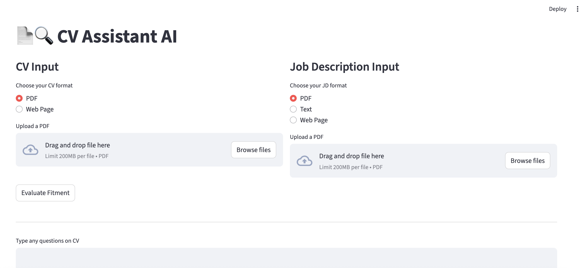

# cvpilot

        AI copilot for CV/resume evaluations like a bird on LinkedIn
        — just trying to land the perfect job without ruffling too many feathers

## Basic App

### How to setup ?

        Basic App uses Google's Gemini as it has good free tier options https://ai.google.dev/gemini-api/docs/rate-limits#free-tier

        Step1: Generate API key from https://aistudio.google.com/app/apikey
                and set it in .env

        Step2: Pick a model from https://ai.google.dev/gemini-api/docs/rate-limits#free-tier
                and configure it at basic_app/gemini_agent.py 

        Step3: Install required libraries
                If you have virtual env then make sure to use "poetry env use"
                poetry install

        Step4: Test your code
                python basic_app/main.py

### Basic App flow

    [User Uploads Resume PDF/DOCX]
            ↓
    [Resume Extraction]
            ↓
    [JD Extraction]
            ↓
    [Agent (Gemini / LangChain / CrewAI)]
            ↓
    - Loads JD
    - Compares skills, roles, certs, etc.
    - Summarizes match/gaps
            ↓
    [Response Returned to User]

## Full App

        Unlike basic_app, this has a small frontend driven by streamlit

### How to build ?

        docker build . -t cvpilot-app
        docker run -v /Users/sheelava/msashishgit/cvpilot/jd:jd -v /Users/sheelava/msashishgit/cvpilot/cv:cv cvpilot-app

### How to use ?

        poetry run streamlit run app/main.py

### Tech Stack

| Feature              | Tool                                        |
| -------------------- | ------------------------------------------- |
| Resume Parsing       | `pdfplumber`, `python-docx`, `unstructured` |
| LLM                  | Gemini LLM /OpenAI GPT / Vertex AI (GCP)    |
| Agentic Framework    | `LangChain` or `CrewAI`                     |
| Optionally Deploy UI | Streamlit / Flask                           |

## Extras

### Using an already created virtualenv within poetry 

1. Create a virtualenv inside your repo directory
        python -m venv .venv-cvpilot
        ...or...
        pyenv virtualenv 3.11.2 .venv-cvpilot

2. (the trick) Make poetry use an existing virtual environment
        - Setup in-project configuration
                poetry config virtualenvs.in-project true
        - Activate virtual env 
                 source .venv-cvpilot/bin/activate
        - Tell poetry to use existing virtual environment
                poetry env use  /Users/sheelava/msashishgit/cvpilot/.venv-cvpilot/bin/python

### About streamlit

        streamlit helps convert raw data into visual delight - tables, histogram etc
                https://docs.streamlit.io/
                https://docs.streamlit.io/get-started/tutorials/create-an-app

        streamlit run pick.py  

